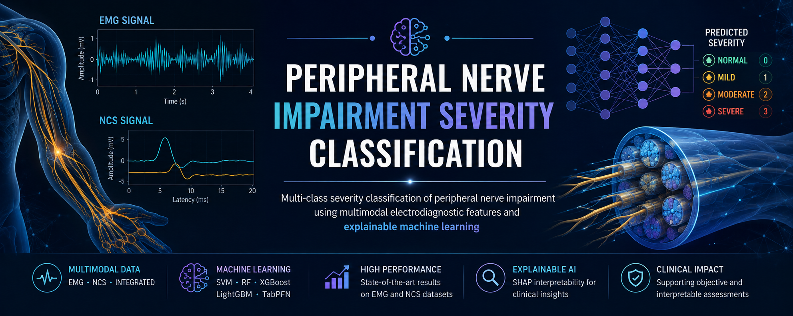
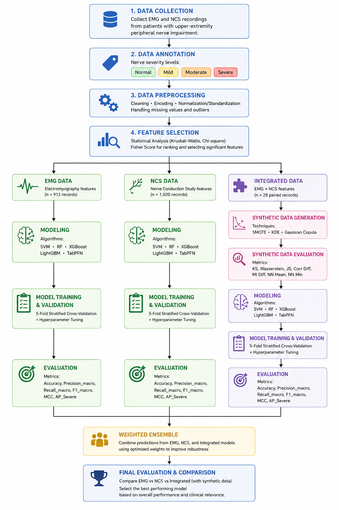
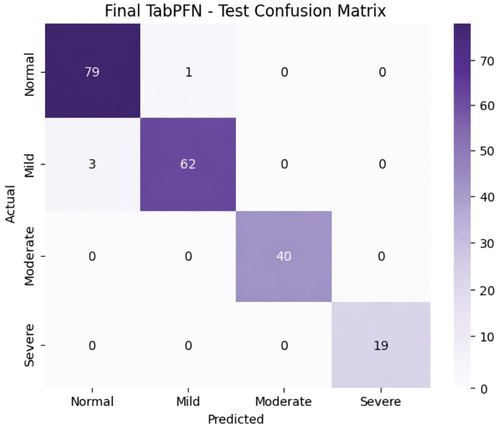
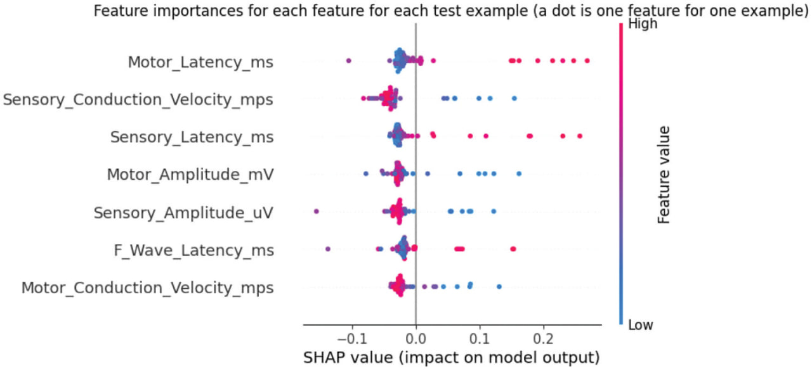

  

# 🧠 Peripheral Nerve Impairment Severity Classification

### Multi-Class Severity Classification of Peripheral Nerve Impairment Using Multimodal Electrodiagnostic Features and Explainable Machine Learning

An explainable machine learning framework for classifying upper-extremity peripheral nerve impairment into four severity levels using Electromyography (EMG), Nerve Conduction Study (NCS), and integrated electrodiagnostic features.

  
  
  
  
  

---

## 📌 Overview

Peripheral nerve impairment assessment relies heavily on the interpretation of electrodiagnostic tests by specialized clinicians. This project explores the use of machine learning to support objective and interpretable severity classification based on EMG and NCS measurements.

The framework classifies peripheral nerve impairment into four classes:

- **Normal**
- **Mild**
- **Moderate**
- **Severe**

Three data configurations were investigated:

- EMG-derived features
- NCS-derived features
- Integrated EMG–NCS features

---

## 📊 Dataset

The study evaluated three clinical electrodiagnostic datasets:

| Dataset | Samples | Features |
|---|---:|---:|
| EMG | 912 | 10 |
| NCS | 1,020 | 13 |
| Integrated EMG–NCS | 28 | 17 |

The data were derived from anonymized clinical electrodiagnostic records.

> **Note:** The clinical datasets are not included in this repository to protect patient privacy and comply with research ethics requirements.

---

## ⚙️ Machine Learning Pipeline

The study followed a structured machine learning workflow across EMG, NCS, and integrated EMG–NCS data.

  

  <em>Overall methodology for data preprocessing, feature selection, model development, validation, and evaluation.</em>

---

## 🤖 Models

Five machine learning classifiers were evaluated:

- Support Vector Machine (SVM)
- Random Forest
- XGBoost
- LightGBM
- TabPFN

A performance-weighted ensemble of selected models was also evaluated.

---

## 📈 Key Results

### EMG

The ensemble of **SVM, Random Forest, and TabPFN** achieved:

- **Accuracy:** 73.77%
- **Macro F1-score:** 72.64%
- **AP Severe:** 88.82%

### NCS

**TabPFN** achieved the strongest standalone performance:

- **Accuracy:** 98.04%
- **Macro F1-score:** 98.60%
- **MCC:** 97.20%
- **AP Severe:** 100%

  

  <em>Confusion matrix of the final TabPFN model on the NCS test set.</em>

The results demonstrate the strong discriminative capability of NCS-derived features for peripheral nerve impairment severity classification.

---

## 🔍 Explainable AI

SHAP (SHapley Additive exPlanations) was used to interpret model predictions and identify the electrodiagnostic features contributing most strongly to severity classification.

Key findings included:

- **MUAP polyphasia percentage** was the dominant EMG predictor.
- **Sensory and motor latency** were among the most influential NCS predictors.
- Conduction velocity measurements also played an important role in distinguishing severity levels.

This explainability component helps connect machine learning predictions with clinically meaningful electrodiagnostic characteristics.

  

  <em>SHAP summary plot for the Severe class using NCS features.</em>

---

## 🔗 Multimodal EMG–NCS Analysis

Only **28 paired EMG–NCS clinical records** were available for multimodal analysis.

To investigate the feasibility of multimodal learning under this limited-data setting, synthetic data generation approaches were evaluated, including:

- SMOTE
- Kernel Density Estimation (KDE)
- Gaussian Copula

Synthetic augmentation was applied only to training data to prevent data leakage.

Due to the small number of real paired records, the integrated analysis should be considered a **proof of concept** requiring validation on larger clinical cohorts.

## 🛠️ Technologies

### Programming & Analysis
- Python
- Jupyter Notebook
- Google Colab

### Machine Learning
- Scikit-learn
- XGBoost
- LightGBM
- TabPFN

### Explainable AI
- SHAP

### Data Analysis
- Pandas
- NumPy
- SciPy

## 📄 Publication

This project resulted in a peer-reviewed research publication in **Neurological Research**.

**Title:**  
*Multi-Class Severity Classification of Peripheral Nerve Impairment Using Multimodal Electrodiagnostic Features and Explainable Machine Learning*

**Journal:** Neurological Research  
**Published online:** August 4, 2026  
**DOI:** [10.1080/01616412.2026.2712459](https://doi.org/10.1080/01616412.2026.2712459)

  

## 👥 Authors

Alanoud S. Almakadi · Dana S. Alnemari · Nadine T. Alsahafi · Salma N. Almutairi · Sarah M. Sadik · Noura M. Alotaibi · Ali N. Alshammari

**Affiliation:** Computer Science and Artificial Intelligence Department, University of Jeddah, Jeddah, Saudi Arabia.

> The first five authors contributed equally to this work.
